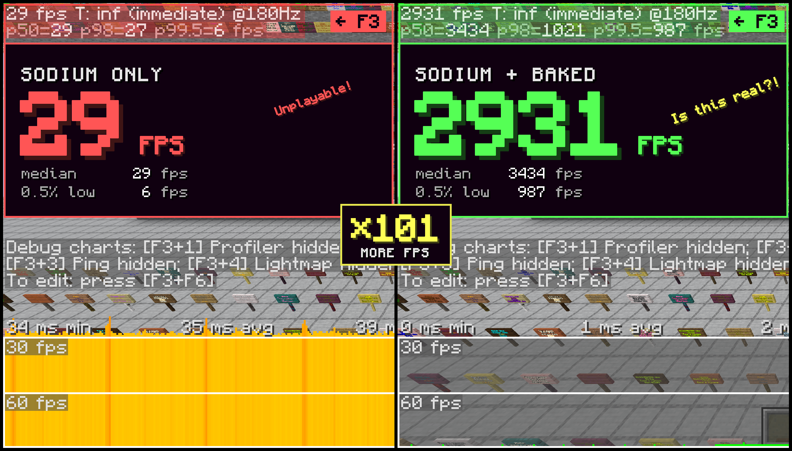

<h1 align="center">Baked</h1>

<b>Your signs called. They are done eating your FPS.</b>

  

Baked is a client-side Fabric mod for Minecraft 26.3 and 26.2, a fork of
[Optimized Block Entities](https://modrinth.com/mod/obe). It gives you a big FPS boost in places
stuffed with block entities and decorative entities: storage rooms, shops covered in signs, map
art, armor stand galleries. You know, the places where your game usually starts crying.

## What gets baked

- Chests, shulker boxes, signs, banners, heads (custom player heads too), bells, decorated pots,
  lecterns, campfires, beacons and a few more
- Item frames and whatever is inside them, maps included
- Paintings
- Armor stands, together with their armor and held items
- Sign text, which also stays readable from any distance as a bonus

Everything can be turned on or off separately.

## How it works

Normally Minecraft draws each of these things on its own, every single frame. A thousand item
frames means a thousand little jobs, sixty times a second. Your CPU is not amused.

Baked does the work once: it takes their models and bakes them right into the chunk mesh, the same
thing regular blocks are made of. After that they cost about as much as a block of dirt. When
something changes, like a new item in a frame or new text on a sign, only that bit goes back in
the oven.

Animations still play: chests open, bells ring. While something moves, vanilla rendering takes
over, and once it stops it gets baked again.

The entities stay real entities, so the server doesn't notice a thing. Punch them, break them,
spin items in frames, all like before.

## Good to know

- Needs Fabric API. Works with Sodium and Iris.
- Don't install it together with OBE or Better Block Entities, they fight over the same code.
- Settings live in Mod Menu, Sodium's video settings, or behind `/bakedConfig`.
- Something looks weird? Look at it, run `/baked debug` and attach the output to your issue.
- Want to build it yourself? Grab JDK 25 and run `./gradlew build`.

## Credits

Huge thanks to maDU59_ for [OBE](https://modrinth.com/mod/obe) and ceeden for
[Better Block Entities](https://modrinth.com/mod/better-block-entities). Baked stands on their
work. Please don't bother them with Baked bugs, bother me instead.

Baked was made with the help of Claude Code. Turns out it's
pretty good at baking too.

Licensed under LGPL-3.0-or-later, same as OBE and BBE. See [LICENSE](LICENSE) and
[COPYING](COPYING).

Copyright 2025 ceeden, 2026 maDU59_, 2026 NEDOSTUPN0.
